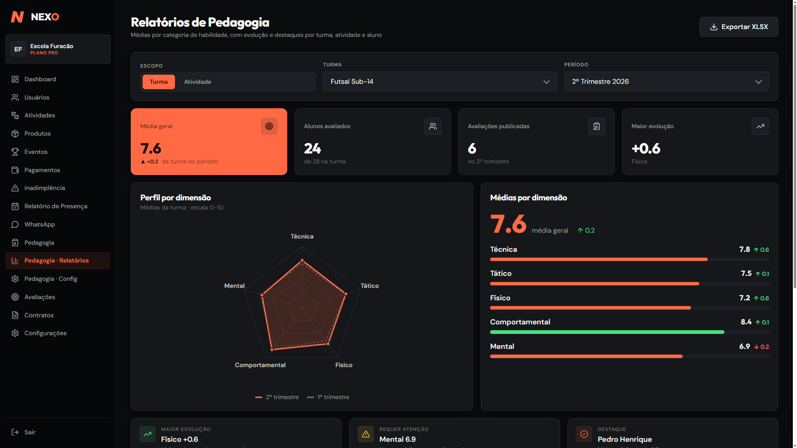

# Rafael Andrade Silva - Portfolio

Portfolio pessoal criado para apresentar minha atuacao como Frontend Developer, com foco em interfaces de produto, experiencia de usuario, SaaS, dados e integracoes reais.

O site destaca minha experiencia com Angular, React, TypeScript, Supabase, PostgreSQL, pagamentos, WhatsApp e desenvolvimento assistido por IA com revisao tecnica.

## Destaques

- Apresentacao profissional direta para recrutadores.
- Case principal do Nexo, um SaaS multi-tenant para gestao escolar e pagamentos.
- Stack organizada por area: interface, dados, operacao e qualidade.
- Contatos profissionais com LinkedIn, e-mail e WhatsApp.

## Case principal: Nexo

O Nexo e um projeto pessoal em producao que reune gestao de alunos, cobrancas, assinaturas, inadimplencia, comunicacao e indicadores financeiros.

O que o projeto demonstra:

- Arquitetura multi-tenant com `organization_id` e Row Level Security.
- Supabase/PostgreSQL para dados, autenticacao, funcoes e realtime.
- Integracao com Mercado Pago para PIX, pagamentos avulsos e recorrencia.
- Webhooks idempotentes e reconciliacao de cobrancas.
- Integracao com WhatsApp via Evolution API.
- Dashboards e KPIs para operacao financeira e pedagogica.



## Stack

- Frontend: React, TypeScript, Angular, JavaScript, CSS e SCSS.
- Dados e seguranca: Supabase, PostgreSQL, Auth, Edge Functions, Realtime e RLS.
- Operacao: Mercado Pago, PIX, Webhooks, Evolution API e WhatsApp API.
- Qualidade: Playwright, Vitest, staging, migrations, code review e documentacao.

## Como visualizar

Abra o arquivo `index.html` diretamente no navegador.

```bash
start index.html
```

## Contato

- LinkedIn: https://www.linkedin.com/in/rafael-andrade-vitorio/
- GitHub: https://github.com/RafaelAndradeVitorio
- E-mail: raafael4212@gmail.com
