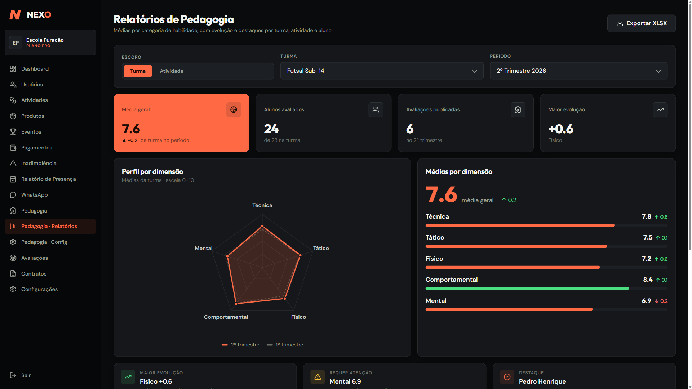

# Rafael Andrade Silva - Portfolio

Portfolio pessoal para apresentar meu trabalho como desenvolvedor frontend para clientes: sistemas e SaaS, paineis e dashboards, sites e landing pages, do escopo a publicacao.

O site mostra produtos reais publicados, os servicos, o processo de trabalho e leva o visitante a pedir um orcamento pelo WhatsApp com a mensagem pronta.

## Destaques

- Projetos em producao: Nexo, Conexao Urbana, Balcao Digital, Conferencia Comunidade Profetica e Painel Financeiro do Crente.
- Servicos, processo em 3 passos e uso de IA com revisao humana.
- Contato com escolha do tipo de projeto e mensagem pronta no WhatsApp.
- Tres idiomas (PT, EN, ES) com traducoes por chave (`data-i18n`).
- Layout responsivo, tema claro, tipografia Schibsted Grotesk. Diretrizes de design em `PRODUCT.md`.

## Case principal: Nexo

O Nexo e um projeto pessoal em producao que reune gestao de alunos, cobrancas, assinaturas, inadimplencia, comunicacao e indicadores financeiros.

O que o projeto demonstra:

- Arquitetura multi-tenant com `organization_id` e Row Level Security.
- Supabase/PostgreSQL para dados, autenticacao, funcoes e realtime.
- Integracao com Asaas para PIX, pagamentos avulsos e recorrencia.
- Webhooks idempotentes e reconciliacao de cobrancas.
- Integracao com a API oficial do WhatsApp (WhatsApp Business API).
- Dashboards e KPIs para operacao financeira e pedagogica.



## Stack

- Frontend: React, TypeScript, Angular, JavaScript, CSS e SCSS.
- Dados e seguranca: Supabase, PostgreSQL, Auth, Edge Functions, Realtime e RLS.
- Operacao: Asaas, PIX, Webhooks e API oficial do WhatsApp.
- Qualidade: Playwright, Vitest, staging, migrations, code review e documentacao.

## Como visualizar

Abra o arquivo `index.html` diretamente no navegador, ou sirva a pasta localmente:

```bash
python -m http.server 5500
```

## Contato

- LinkedIn: https://www.linkedin.com/in/rafael-andrade-vitorio/
- GitHub: https://github.com/RafaelAndradeVitorio
- E-mail: raafael4212@gmail.com
